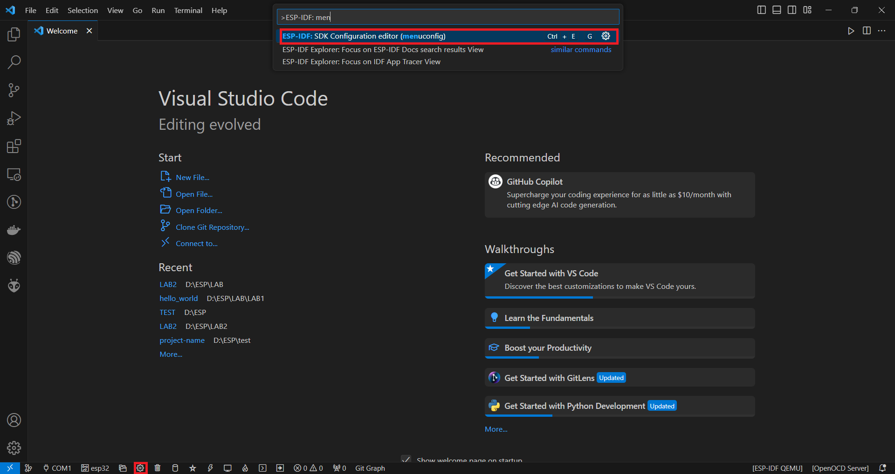
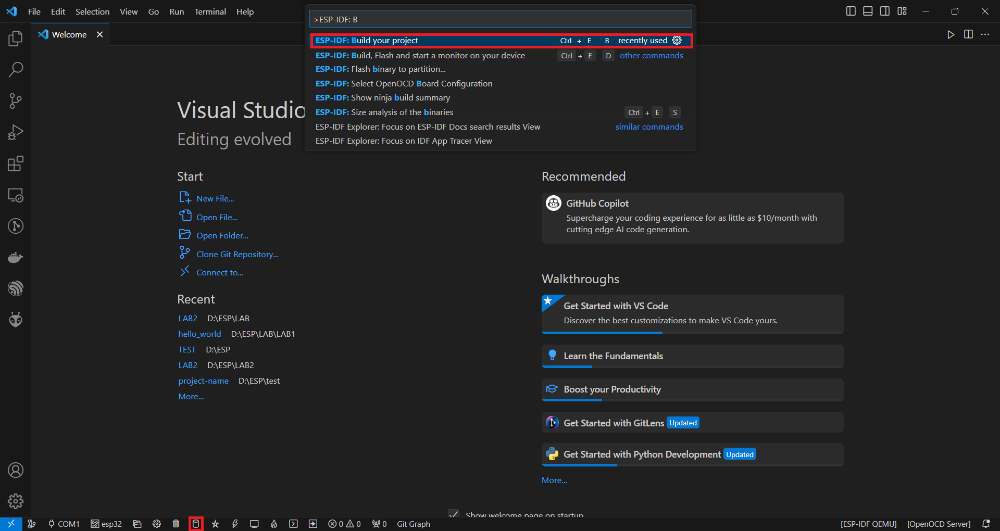
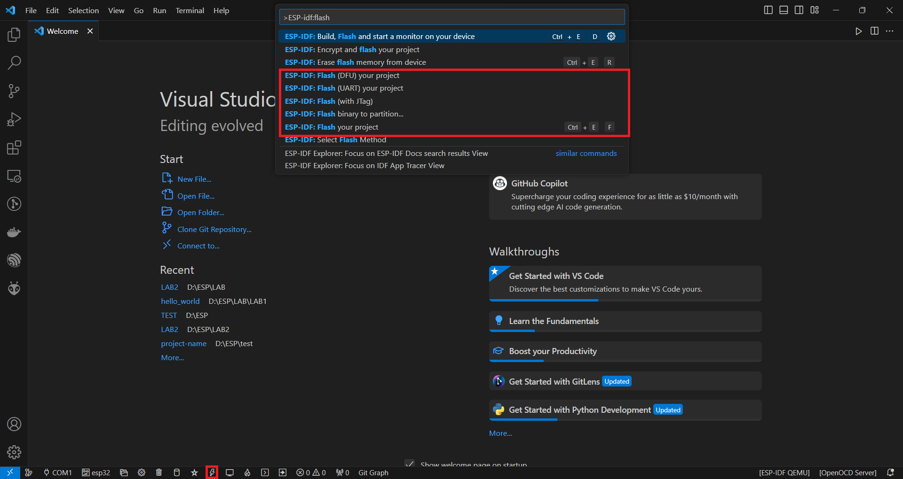
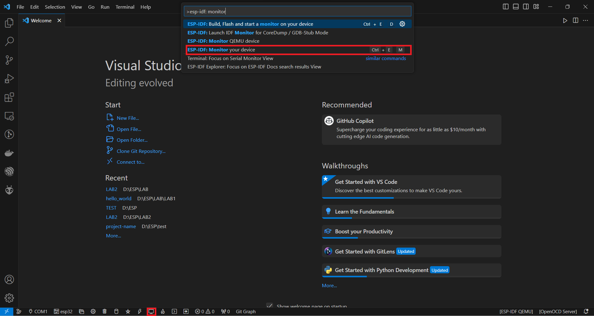
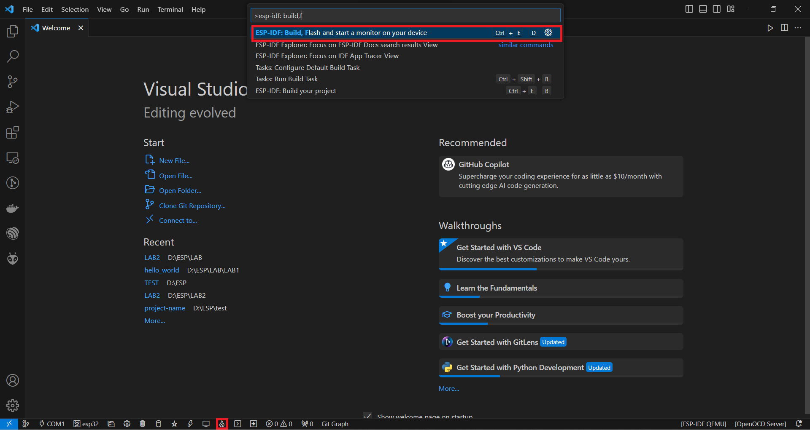

# STEP TO BUILD

If you use "ESP-IDF Explorer" on Visual studio code, please follow these steps:

- Step 1: Use menuconfig

- Step 2: Build project
  

- Step 3: Flash project

- Step 4: Monitor project

Or, to simplify things, you can merge steps 2, 3, and 4 into one step in "ESP-IDF Explorer":

